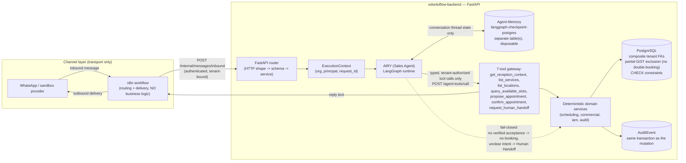

# Architecture

This is the canonical explanation of how OdontoFlow's Reception / Scheduling
v1 flow is meant to work, and what is verified real today versus still open.
For verified numbers (heads, test counts, PASS/BLOCKED activities) always
defer to [`STATUS.md`](../STATUS.md) — this document explains shape, not
state.

## What OdontoFlow is

A deterministic, multi-tenant clinic operations platform. PostgreSQL is the
single source of business truth; FastAPI is the only door to it. **AIRY** is
the Sales Agent persona that talks to leads/patients over a messaging channel
and turns a conversation into a proposed, then confirmed, Appointment — but it
holds no authority of its own. Every price, slot, and booking decision it
produces is computed by the same deterministic services a human ERP user
calls. See [`CONTEXT.md`](../CONTEXT.md) for the exact vocabulary (Contact,
Conversation, Sales Agent, Typed tool, Human Handoff, Agent Memory, Business
State).

`AIRYTHM-REALITY-01` and the closeout chain that followed it
(`RECEPTION-CORE-CLOSEOUT-01`, `CHAN-01`, `CHAN-02`, …) are the internal
codenames for the read-only reality audits and repair activities that
verified this flow against real PostgreSQL; they are not a second product.

## Reception / Scheduling v1 — the flow

```
lead/patient -> conversation -> service -> location -> practitioner ->
deterministic availability -> proposal -> authorized confirmation -> appointment
```

This component is defined and tracked in
[`docs/handoffs/plans/2026-09-17-reception-core-closeout-01.md`](handoffs/plans/2026-09-17-reception-core-closeout-01.md)
and its DONE contract
([`...-reception-core-closeout-01.yaml`](handoffs/plans/2026-09-17-reception-core-closeout-01.yaml)).
**As of 2026-09-17 it is NOT DONE** — catalog, location, practitioner,
tenant-scoped availability, appointment mutation, IAM, audit, canonical
sandbox ingress/replay, and the local sandbox seam are evidenced against the
backend, but proposal accept/list/decline, truthful agent-failure recovery,
bounded outbound draining, provider-boundary tests and release/runtime
reconciliation are still open. Do not read this diagram as "shipped."



## The five principles this diagram encodes

1. **n8n is transport/orchestration, never business truth.** It routes
   inbound provider events to the backend's authenticated ingress and carries
   outbound replies back to the channel. It holds no pricing, availability,
   tenant, or booking-state logic; those live only in PostgreSQL and
   `app/`. A repair or replacement of n8n must never change a business
   outcome.
2. **PostgreSQL is the final authority.** Availability conflicts are a
   partial GiST exclusion constraint (physically impossible to double-book,
   even under a race); tenant integrity is enforced by composite foreign
   keys, not application-layer checks.
3. **Agent Memory is separate from Business State.** AIRY's own
   conversation/reasoning state is checkpointed by `langgraph-checkpoint-postgres`
   in its own store (`sales_agent/memory.py`); it is disposable and must never
   be the system of record for a Lead, Conversation, or Appointment. Dropping
   it loses fluency, never a canonical fact.
4. **Typed, tenant-authorized tools are the only way in.** AIRY (and any
   future adapter) can only act through the fixed, allowlisted tool set
   behind `POST /agent-tools/call`. If a capability has no typed tool, no
   agent can do it — that is the enforcement mechanism, not a convention.
5. **Booking is fail-closed.** A proposal never becomes a confirmed
   Appointment on same-turn agent say-so: `AGENT-CONFIRM-GUARD-01` requires a
   persisted, later inbound message in the same conversation, and
   `AGENT-CONFIRM-FAIL-CLOSED-03` rejects agent-driven confirmation entirely
   when no verified, trusted patient-acceptance signal exists — the proposal
   stays pending rather than silently booking. Ambiguous or out-of-remit
   turns route to Human Handoff, a canonical, tool-triggered state
   transition, not a paused loop.

## Verified vs. open, at a glance

| Layer | Verified real (sandbox-proven against real PostgreSQL) | Still open |
|---|---|---|
| Domain core (scheduling, IAM, audit, idempotency) | Yes — see `STATUS.md` PF1–PF7, M4 | Price field on `Service`; no live clinic data loaded |
| Sales Agent runtime + 7-tool gateway | Yes — `sales_agent/` vertical, fake-model and sandbox-model turns | OpenRouter configuration exists, but a complete real-model acceptance loop is not closed and no paid/production model budget is approved |
| Inbound channel | Sandbox provider only (`CHAN-01` PASS) | Real WhatsApp provider/credentials not chosen |
| Outbound channel | Sandbox provider only (`CHAN-02` PASS) | Real WhatsApp delivery; `CHAN-03`/`CHAN-04` transport/provider-boundary tests not yet dispatched |
| Booking confirmation | Fail-closed guard proven (`AGENT-CONFIRM-GUARD-01`, `AGENT-CONFIRM-FAIL-CLOSED-03`) | Trusted proposal-bound acceptance mechanism (would let automatic confirmation resume) |
| Reception/Scheduling v1 component | Substantial pieces, individually proven | **NOT DONE as a whole** — see the closeout brief above |
| Frontend | Canonical `origin/main` healthy | One local, unauthorized FE3A commit blocks publication — see [`REPOSITORIES.md`](../REPOSITORIES.md) |

## Where the deeper detail lives

- Backend module boundaries, invariants, error contract:
  `odontoflow-backend/docs/architecture.md`.
- Backend AS-IS / TO-BE / gap analysis:
  `odontoflow-backend/docs/architecture/{AS-IS-backend,TO-BE-agentic-erp,GAP-and-roadmap}.md`.
- Reception/Scheduling v1 closeout plan and DONE contract:
  [`docs/handoffs/plans/2026-09-17-reception-core-closeout-01.md`](handoffs/plans/2026-09-17-reception-core-closeout-01.md)
  / `.yaml`.
- This publication pass's full status and open questions:
  [`docs/handoffs/plans/2026-09-17-project-publish-01.md`](handoffs/plans/2026-09-17-project-publish-01.md).
